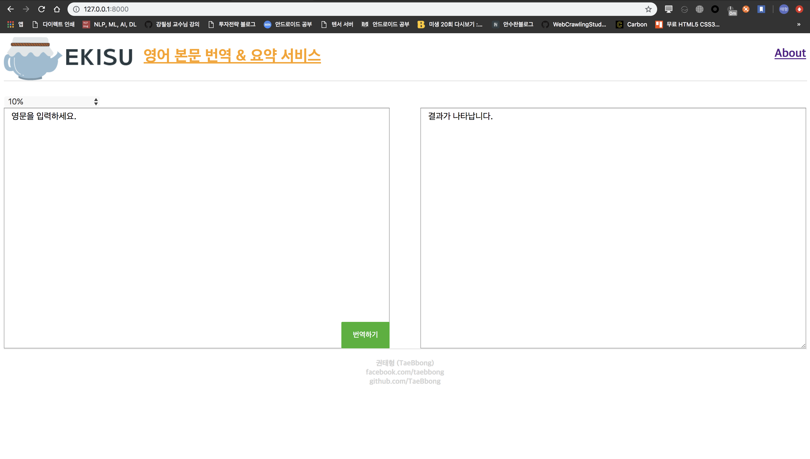
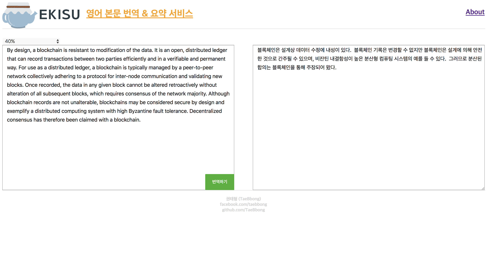

# 엑기스(Ekisu)
* 영어 본문 번역 & 요약 웹 서비스
* English-To-Korean Translate & Summarize WebService

## 소개(Intro)
* 긴 영어 본문을 번역하고 요약하는 서비스를 제공하는 웹 프로젝트입니다.
* 바쁜 시험기간 수십페이지에 달하는 영어 원서를 읽어야 하는 대학생부터, 빨리 요약해서 읽고 일해야하는 직장인까지!
* 저희 엑기스를 통해 긴 영어 본문을 빠르게 이해해보세요.

* Ekisu is a project translate & summarize huge mount of english text.
* Ekisu's service targets are college students who have to read long english text in a short term, and anyone who wants to read english text shortly.
* You can read & understand long english text rapidly using our service, Ekisu.

## 미리보기(Trial View)

## 개발 스택(Development Stack)
* BackEnd: Django
* FrontEnd: HTML5, CSS
* Algorithm: TextRank, Konlpy, PapagoAPI

## 오픈소스 라이센스(Opensource License)
* GNU v3 or more

## 질문(Questions)
* 궁금한 점이 생기시면 언제든 mok05289@naver.com으로 문의주세요!
* If you have any questions, mail to mok05289@naver.com!
